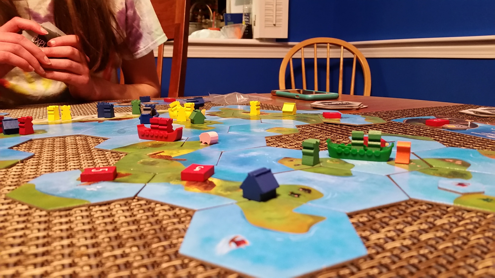
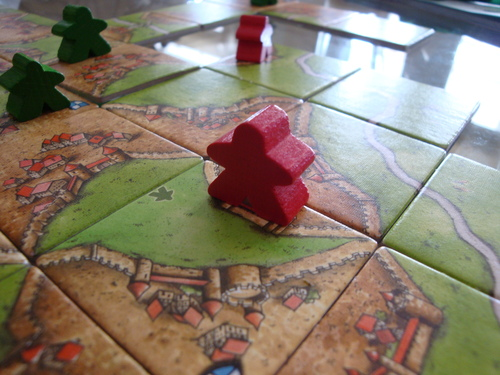

```{r setup, include=FALSE, echo=FALSE}
knitr::opts_chunk$set(echo = TRUE)
```

# Objective
This project will recommend board games to avid board game hobbyists based on their collection and interests as indicated in their online profile.

This is my capstone project for the [Foundations of Data Science](https://www.springboard.com/workshops/data-science/) workshop at [Springboard](https://www.springboard.com).



This benefits:

* Dedicated gamers (dedicated enough to build an online profile) who want to find new games to play
* Vendors who want to recommend games to buy
* Designers who want to predict the success of their game designs based on criteria like theme or the mechanics

For this iteration, I'll focus on features for gamers.

### What's a meeple?
The board games we'll consider are modern strategy games like [Pandemic](https://boardgamegeek.com/boardgame/30549/pandemic), [Dominion](https://boardgamegeek.com/boardgame/36218/dominion), [7 Wonders](https://boardgamegeek.com/boardgame/68448/7-wonders), and [King of Tokyo](https://boardgamegeek.com/boardgame/70323/king-tokyo).



Many modern strategy [games use meeples](https://boardgamegeek.com/geeklist/51968/games-featuring-meeple). Meeples are the wooden tokens that look a little like people.


## Data Source and Collection
I'll use explicit rating data from the gamer's profile on the [BoardGameGeek](https://www.boardgamegeek.com) (BGG) website, including:

* Games they own
* Numeric ratings they've posted (but not text comments)
* Wish list (and numeric desirability rating)

BGG has over 91,000 games and 1.5 million registered users. From within that pool I'll draw:

* From gamers who have rated the game, their ratings and other games they've rated
* Other data about the games like the theme, the type, and play mechanics

I'll collect this via BGG's [XML API](https://boardgamegeek.com/wiki/page/BGG_XML_API2). The [Terms of Use](https://boardgamegeek.com/wiki/page/XML_API_Terms_of_Use#) includes:

  >a worldwide, non-exclusive, royalty-free license to reproduce and display the data available through the BGG XML API, including User Submissions, solely for strictly non-commercial purposes 


## Solution
For gamers who have listed and rated the games they own within the BGG site, I can provide a hybrid recommendation engine with both collaborative and content-based filtering methods.

I'll use collaborative-filtering to identify other gamers who have positively rated games in common with the user, and then recommend games liked by the other gamers but unknown to the user.

I'll use content-based filtering to find games with theme, type, and mechanics of interest.

The project will be implemented in R.

## Deliverables
This project will provide the source code, several sample reports, an analysis of the effectiveness of the solution, suggested next steps, and slide show summary.

The source code (and this proposal) are stored on [github](https://github.com/mikec964/meeple-matcher).

Sample reports will be stored on [rpubs](http://rpubs.com/mike3d0g).

